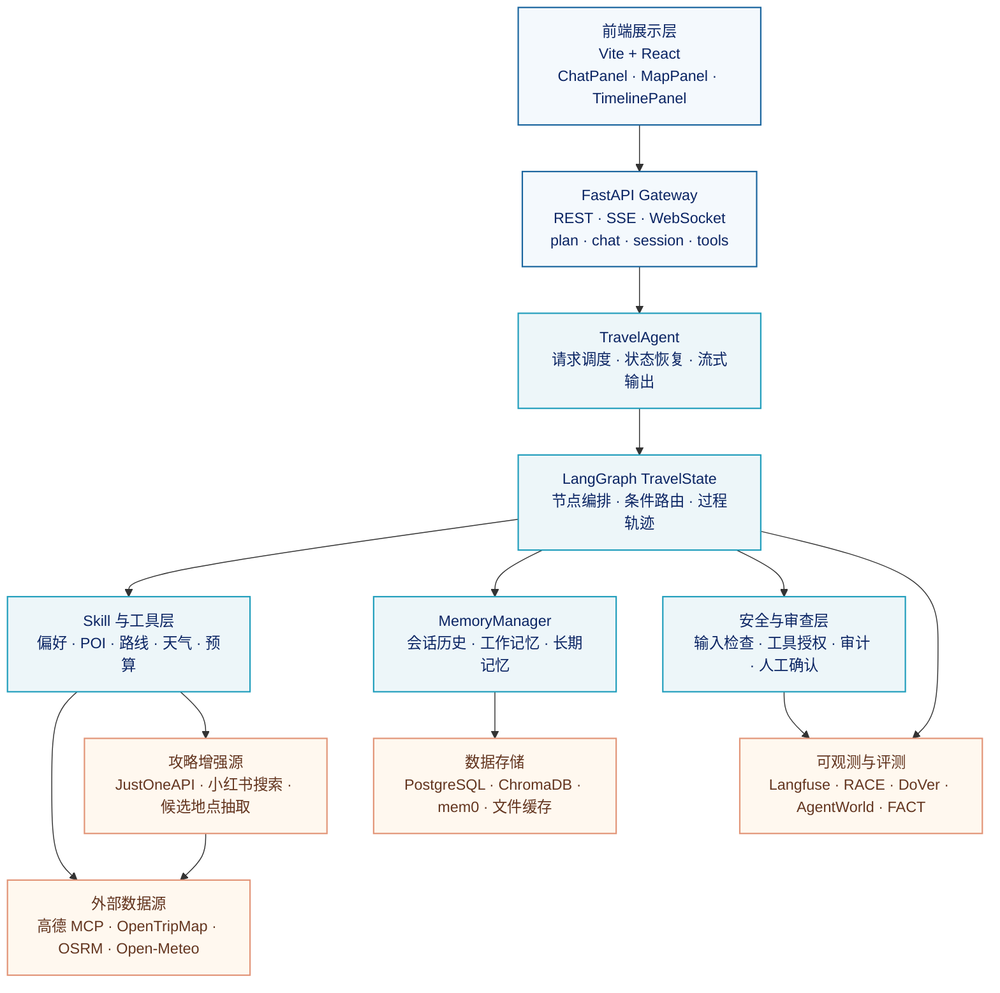
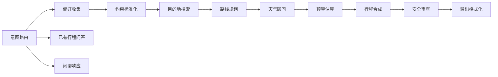

# WanderMind 旅行代理系统

WanderMind 是一个面向真实旅行规划场景的多智能体应用。用户只需要输入目的地、出行天数、预算和偏好，系统就会完成需求理解、景点搜索、路线安排、天气查询、预算估算和行程生成，并通过地图、时间线和工具调用记录展示规划过程。

系统的核心目标不是简单生成一段旅行文字，而是把“用户意图 → 外部数据 → 多步规划 → 安全校验 → 可视化结果”组织成一条可追踪、可调整的执行链路。

## 1. 功能点

### 1.1 自然语言旅行规划

- 支持用户用自然语言描述目的地、天数、预算、同行人和兴趣偏好。
- 从输入中提取目的地、时间、预算、兴趣类型、交通方式等结构化信息。
- 当关键信息不完整时，系统先追问，而不是直接生成不可靠的行程。
- 支持新规划、补充澄清、针对已有行程提问和普通闲聊等不同意图。

### 1.2 多源景点搜索

- 使用地理编码获取城市或目的地中心坐标。
- 通过地图和 POI 服务搜索博物馆、历史景点、自然景观、公园、美食和商业区域。
- 引入小红书等第三方旅游攻略搜索，为城市补充本地化、体验型和非热门景点信息。
- 对攻略中提取的候选地点进行名称清洗、类别识别、城市关联和地图校验。
- 对重复景点、同一景区下的子地点进行去重，避免一个景区占满整个行程。

### 1.3 路线与每日行程规划

- 根据景点坐标和用户偏好组织每日访问顺序。
- 使用路线服务估算地点之间的距离、交通方式和耗时。
- 通过最近邻等启发式方法减少不必要的绕路和往返。
- 结合天数、每天可用时间和景点数量拆分为多日行程。
- 在景点不足或路线数据不完整时保留风险提示，并允许后续调整。

### 1.4 天气与预算辅助

- 查询出行日期对应的天气预报。
- 根据天气对户外活动、备选景点和行程节奏进行提示。
- 按交通、餐饮、门票、住宿和其他支出估算预算区间。
- 将预算估算与用户预算对比，提示可能超支的部分。

### 1.5 可视化规划结果

- ChatPanel：展示用户与旅行代理的对话和追问过程。
- MapPanel：在地图上展示景点、路线和坐标信息。
- TimelinePanel：按天和时间段展示行程安排。
- ToolCallsPanel：展示搜索、地理编码、路线和天气等工具调用记录。
- TracePanel：展示节点执行轨迹、状态变化和中间结果。
- MetricsPanel：展示规划耗时、工具调用数量和评测信息。
- SafetyPanel：展示风险提示、需要确认的动作和安全检查结果。

### 1.6 会话与持续调整

- 保存会话历史和当前行程状态。
- 支持继续追问，例如修改预算、减少景点、调整节奏或更换交通方式。
- 支持查看已有会话、读取会话快照和删除会话。
- 针对已有行程的问题直接基于当前数据回答，避免每次都重新执行完整规划。

## 2. 项目亮点

### 2.1 从单次生成变成状态机执行

系统不是一次性调用大模型生成最终答案，而是使用 LangGraph 管理 `TravelState`。每个节点只负责一个阶段，节点之间通过状态传递结果，因此可以记录当前节点、工具调用、风险提示、候选景点和最终行程。

这种方式带来三个好处：

- 可以在中间节点发现信息缺失并追问用户。
- 可以定位问题发生在搜索、路线、天气还是合成阶段。
- 可以将每个阶段的中间结果展示给用户，而不是只展示最终文本。

### 2.2 地图数据与攻略数据互补

地图服务适合提供坐标、标准 POI 和路线，但对小众地点、网红路线和本地体验的覆盖并不总是充分。攻略平台能提供更丰富的真实游玩信号，但数据格式不稳定，不能直接当作真实景点使用。

系统采用“攻略发现候选 + 地图服务验证”的组合方式：

1. 通过城市旅游攻略搜索获取笔记和内容片段。
2. 从内容中提取可能的景点名称。
3. 清理攻略标签、情绪词、路线词和非地点文本。
4. 将候选地点与城市拼接后交给地图服务进行地理编码和 POI 校验。
5. 只有通过校验的候选才进入后续路线规划。

### 2.3 过程可解释，而不只是结果可读

每次规划都会记录节点轨迹、工具输入输出、执行耗时、数据来源和风险信息。前端可以看到系统正在执行什么、调用了什么工具、哪些数据来自外部服务，以及哪些结果存在不确定性。

### 2.4 记忆分层，控制上下文规模

系统将会话历史、当前任务状态和长期偏好分开处理：

- 会话历史保存完整对话，支持回看和恢复。
- 工作记忆保存当前目的地、预算、天数和待补充字段。
- 长期记忆保存用户偏好、历史行程和可复用经验。
- ContextManager 负责压缩、裁剪和组合上下文，避免把全部历史直接塞给模型。

### 2.5 外部服务失败时可以降级

- LLM 意图识别失败时，使用启发式规则识别基本意图。
- 小红书接口失败时，保留地图搜索链路。
- 地理编码失败时，保留已经完成地点校验的攻略候选。
- Langfuse 追踪失败时，不阻断主规划流程。
- ChromaDB 或 mem0 不可用时，使用本地降级实现或基础记忆能力。

## 3. 系统架构

下面的架构图采用模块化 UML 风格表达：每个模块代表一个职责边界，箭头表示主要的数据流或调用关系。

### 3.1 前端展示层

前端使用 Vite + React 构建，主要职责是承接用户输入、建立流式连接和展示执行过程。它不负责决定旅行规划逻辑，而是将后端返回的状态、消息、工具调用和路线数据转换成可交互界面。

### 3.2 FastAPI Gateway

FastAPI 作为统一入口，提供以下能力：

- `/api/plan`：创建一次完整规划。
- `/api/plan/stream`：以 SSE 流式返回规划进度。
- `/api/chat`：围绕已有行程进行对话。
- `/api/chat/stream`：以 SSE 流式返回聊天内容。
- `/ws/chat/{session_id}`：通过 WebSocket 进行实时会话。
- `/api/session`、`/api/sessions`：读取和管理会话状态。
- `/api/tools`：查看当前可用工具。
- `/api/evaluations`：读取评测结果。

### 3.3 TravelAgent 与 LangGraph

`TravelAgent` 负责连接 API 层、状态图、记忆管理和流式事件。`graph.py` 负责定义节点和状态转移，核心规划路径为：

核心状态包含：

- `preference`：用户偏好和旅行基本信息。
- `constraints`：标准化后的预算、天数、节奏和交通约束。
- `poi_list`：候选景点和来源信息。
- `route`：地点顺序、距离和交通耗时。
- `weather`：天气信息和风险提示。
- `budget`：预算拆分和总预算区间。
- `tool_calls`：工具调用记录。
- `trajectory`、`node_snapshots`：节点轨迹和状态快照。
- `cited_sources`：引用的数据来源。
- `risk_alerts`、`confirmation_required`：风险和人工确认信息。

## 4. 核心模块

### 4.1 Preference 与 Constraint

偏好收集器负责从自然语言中提取目的地、天数、预算、兴趣和出行方式。约束标准化器再将这些信息转成后续节点可以直接使用的结构化字段，并识别缺失信息。

### 4.2 Destination Search

目的地搜索不是单一接口调用，而是多路数据合并：

- 先调用攻略搜索获取本地化候选。
- 再调用地理编码确定城市中心坐标。
- 根据兴趣类别搜索地图 POI。
- 进行名称去重、母地点去重和类别均衡。
- 将最终候选限制在适合路线规划的数量范围内。

### 4.3 Route Planner

路线规划器读取景点坐标和交通偏好，调用路线服务获取距离与耗时，并使用启发式顺序减少回头路。路线结果会被拆分到每天的时间段中，再交给行程合成节点生成可读内容。

### 4.4 MemoryManager

记忆门面统一管理以下数据：

- PostgreSQL 中的会话历史和状态快照。
- 当前规划使用的工作记忆。
- ChromaDB 或 Elasticsearch 中的长期向量记忆。
- mem0 提供的可选记忆抽取与检索能力。

记忆检索结果会经过上下文管理器压缩和筛选，只把与当前目的地、兴趣或约束相关的内容放入模型上下文。

### 4.5 Safety 与 Audit

安全层分为多个检查点：

- 输入侧：识别提示注入、敏感信息和不完整约束。
- 工具侧：检查工具白名单、参数安全、域名安全和高风险动作。
- 日志侧：脱敏记录工具参数、结果和安全事件。
- 动作侧：涉及预订、付款等高风险操作时，要求人工确认。

### 4.6 Observability 与 Evaluation

- Langfuse 记录节点、工具、耗时和错误信息。
- RACE 关注最终行程的完整性、可执行性和表达质量。
- DoVer 关注过程推理和决策依据。
- AgentWorld 关注工具选择、参数和动作序列。
- FACT 关注检索事实与最终回答的一致性。
- `failures.jsonl` 保存失败样本，便于回归和定位问题。

## 5. 关键挑战与解决方案

### 5.1 仅按城市地理位置搜索，容易漏掉小众景点

**问题：**

直接通过城市名称进行地理编码，再按中心点搜索附近 POI，能够找到标准化程度较高的景点，但不一定能找到本地人熟悉的小众地点、短视频热门路线和新出现的体验项目。对于景点分散、城市边界较大的目的地，单一中心点搜索还可能产生覆盖不足或结果偏科。

**解决方案：**

- 引入 JustOneAPI 等第三方内容接口搜索“城市 + 旅游攻略”。
- 从小红书笔记中提取候选地点名，而不是把整篇攻略直接交给模型。
- 通过规则和可选的 DeepSeek 抽取器过滤 `攻略`、`路线`、`citywalk`、`打卡` 等非地点词。
- 将候选地点与城市拼接后交给高德进行地理编码和 POI 校验。
- 攻略只负责“发现候选”，地图服务负责“确认真实位置”，避免把营销内容或普通词语当成景点。
- 对小红书接口增加缓存、重试和 V4 → V2 降级，减少外部接口波动对主流程的影响。

### 5.2 外部数据格式不统一

**问题：**

不同服务返回的地点名称、坐标字段、分类字段和列表层级不同，攻略平台还可能返回嵌套数据、HTML 片段或空响应。

**解决方案：**

- 在工具层统一做字段归一化和类型转换。
- 对 `results`、`places`、`items`、`data` 等常见列表结构递归解析。
- 对名称进行去标签、去前缀、去句子残片和长度过滤。
- 对坐标、类别、来源、置信度和错误信息使用统一结构。
- 将原始结果和压缩结果分开保存，方便调试和追踪。

### 5.3 景点重复导致行程内容失衡

**问题：**

地图服务可能同时返回一个大景区和它内部的亭子、长椅、小径、子景点。只按完整名称去重，会让同一个景区占据大量候选位置。

**解决方案：**

- 提取名称中的母地点，例如把“人民公园-西山瀑布”和“人民公园-相亲角”归到同一个母地点。
- 同时使用完整名称去重和母地点去重。
- 按用户兴趣类别轮询选择 POI，保证自然、历史、美食等类别都有机会进入行程。
- 设置候选数量上限，避免过多低质量 POI 进入路线规划。

### 5.4 多步 Agent 容易出现状态丢失和循环

**问题：**

规划过程需要在多个节点之间传递消息、偏好、约束、工具结果和风险信息。如果状态定义不完整，后续节点可能拿不到前面生成的数据；如果条件边设计不严谨，还可能重复执行或陷入循环。

**解决方案：**

- 使用 `TypedDict` 明确定义 `TravelState` 字段。
- 每个节点只更新自己负责的字段，由 LangGraph 负责合并状态。
- 使用 `current_node`、`next_node` 和 `iteration_count` 记录执行位置和循环次数。
- 为意图路由、澄清追问、已有行程问答和闲聊设置独立分支。
- 记录 `trajectory` 和 `node_snapshots`，便于定位状态变化。

### 5.5 长对话导致上下文膨胀

**问题：**

用户可能连续修改目的地、预算和景点偏好。如果每次请求都携带完整历史，模型输入会越来越长，成本、延迟和错误率都会上升。

**解决方案：**

- 原始会话历史负责完整留档，不直接全部发送给模型。
- 工作记忆保存当前任务的结构化槽位。
- 长期记忆只检索与当前请求相关的偏好和历史经验。
- ContextManager 对消息、记忆、工具结果和系统提示词分别分配预算。
- 对旧消息进行摘要、裁剪和相关性过滤。

### 5.6 流式响应与长耗时工具调用的用户体验

**问题：**

景点搜索、攻略接口、路线和天气查询都可能耗时。如果后端只在整个规划完成后返回结果，用户无法判断系统是否仍在工作。

**解决方案：**

- 使用 SSE 推送节点状态、工具调用和阶段性结果。
- 使用 WebSocket 支持实时聊天和会话级通信。
- 增加流式连接保活，避免长任务被中间层误判为断开。
- 前端根据节点事件更新时间线、工具面板和进度状态。
- 单个外部接口失败时记录风险并继续可用的后续路径。

### 5.7 安全检查不能只放在最终输出

**问题：**

如果只检查最终文本，无法阻止危险工具调用、敏感信息外发或不可信域名访问。

**解决方案：**

- 在输入、工具调用、日志和动作确认多个位置设置检查点。
- 工具白名单限制 Agent 可调用的能力范围。
- 参数检查识别密钥、密码和敏感字段。
- 高风险动作进入人工确认流程。
- 审计日志记录授权结果、拦截原因和脱敏后的参数。

## 6. 一次规划的执行过程

1. 用户通过前端输入旅行需求。
2. FastAPI 接收请求并创建或恢复会话。
3. TravelAgent 初始化 `TravelState`，记录会话和流式任务。
4. 意图路由判断是新规划、补充信息、已有行程问答还是闲聊。
5. 偏好收集和约束标准化节点补齐结构化条件。
6. 目的地搜索节点合并地图 POI 与攻略候选，并进行校验、去重和分类均衡。
7. 路线、天气和预算节点分别补充可执行性信息。
8. 行程合成节点生成每日安排、注意事项和数据来源。
9. 安全审查节点检查风险、确认事项和输出完整性。
10. 输出格式化节点生成前端可消费的 Markdown、结构化字段和轨迹信息。
11. 前端同步更新聊天、地图、时间线、工具调用和安全面板。
12. 会话历史、工作记忆、长期记忆和评测信息按配置保存。

## 7. 当前设计取舍

### 为什么保留多种数据源

单一地图服务的数据结构稳定，但对真实游玩体验和小众地点覆盖有限；第三方攻略内容更接近用户实际关注点，但噪声更大。因此系统采用“结构化数据负责验证，内容数据负责发现”的组合，而不是让任何一个数据源承担全部职责。

### 为什么使用状态图

旅行规划天然包含多个有依赖关系的阶段。状态图可以明确每一步输入和输出，也能支持澄清、重试、分支和恢复。相比一个大函数或单次 Prompt，后续增加新的工具、审查节点和重规划分支时更容易控制影响范围。

### 为什么前端展示中间过程

旅行规划的结果会受到天气、预算、接口返回和用户偏好的共同影响。展示工具调用和节点进度，可以让用户知道结果来自哪些数据，也方便发现“景点不足”“路线不可用”或“天气风险”等问题。

## 8. 后续演进方向

- 为不同城市建立更稳定的攻略缓存和地点知识库。
- 将候选地点的来源、热度、验证时间和可信度做成可解释评分。
- 增加多城市路线、跨城交通和住宿联动规划。
- 让用户可以在地图上手动锁定或排除景点，再触发局部重规划。
- 将安全授权和人工确认流程进一步接入真实动作执行前的边界。
- 持续利用失败样本和评测结果优化搜索、路线、提示词与节点路由。
