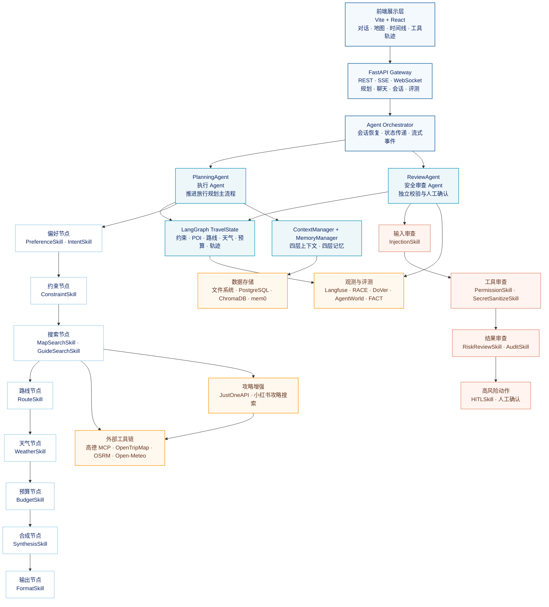

# 多 Agent 旅行规划服务

WanderMind 是一个面向出行旅游场景的智能体旅行规划服务。用户输入“目的地、出行天数、预算、同行人和偏好”等信息后，系统会自动完成需求理解、隐性约束补全、景点搜索、路线规划、天气查询、预算估算和行程生成，最终输出包含 POI、交通路线、天气提示、预算拆分和风险说明的完整旅行方案。

这个项目的核心并不是让大模型直接生成一段看起来完整的旅行文字，而是把一次规划拆成可控的状态机流程，并通过“执行 Agent + 安全审查 Agent + 多 Skill”的组合，把外部数据、用户约束、记忆信息和安全策略组织成一条可追踪的执行链路。

## 一、功能点

### 1.1 从自然语言需求生成结构化旅行方案

用户不需要按照固定表单填写信息，可以直接描述“带孩子去广州玩五天，预算一万元，希望节奏轻松，想去有文化特色的地方”。系统会从自然语言中提取目的地、天数、预算、同行人、兴趣偏好和节奏等字段，再将这些字段转换为后续节点可以使用的结构化状态。

需求处理并不是一次提取结束。当输入中缺少会直接影响规划质量的信息时，系统会进入澄清流程。例如只有“周末去成都”时，系统会继续确认出发城市、具体天数、预算范围和偏好；如果用户说“一家三口去广州”，系统还会结合同行人信息推导儿童友好、低强度、亲子餐饮和休息频率等隐性约束。

### 1.2 多源景点发现与 POI 校验

系统同时使用结构化地图数据和第三方旅游内容。地图服务适合提供标准 POI、经纬度和路线信息，旅游攻略内容则更容易发现本地人熟悉的小众景点、网红路线和新兴体验。

景点搜索会经历“攻略发现、候选抽取、地图校验、去重和分类平衡”几个步骤。第三方攻略只负责提供候选地点，不会被直接当成事实写入行程；候选地点还需要经过城市关联、名称清洗、地理编码或 POI 校验，确认它确实是一个可以被路线规划使用的地点。

### 1.3 多约束路线规划

系统会同时考虑目的地、出行天数、每日时间、景点开放规律、交通方式、预算和用户偏好。路线 Skill 根据景点坐标和交通信息估算地点之间的距离与耗时，再按照天数拆分每日访问顺序，尽量减少来回折返。

硬约束和软偏好会被分开管理：预算上限、天数和必须访问的地点属于硬约束；“节奏轻松”“偏好历史文化”“希望多安排美食”属于软偏好。当硬约束无法满足时，状态机不会继续盲目生成，而是阻断当前路径并要求补充信息、调整约束或采用降级方案。

### 1.4 天气、预算和备选方案

天气 Skill 根据出行日期查询天气，并将高温、降雨、极端天气等因素转化为行程提示。对于户外景点，系统可以给出室内备选或调整访问顺序，而不是只把天气原文附在结果末尾。

预算 Skill 将交通、门票、餐饮、住宿和其他支出拆分成预算区间，并检查总预算是否超出用户约束。预算不是孤立的数字，而是会反向影响景点选择、交通方式和每日安排。

### 1.5 规划过程实时可见

前端通过流式接口接收每个状态节点和 Skill 的执行事件，用户可以看到系统当前正在完成偏好提取、景点搜索、路线规划还是安全审查，而不是等待一个没有过程反馈的黑盒结果。

页面将执行链路拆成多个视图：对话区域展示用户与 Agent 的交互，地图区域展示 POI 和路线，时间线展示每日行程，工具面板展示外部调用，安全面板展示风险和确认事项，轨迹区域展示节点状态和中间结果。

### 1.6 跨会话记忆与持续调整

系统保存用户的会话历史、当前任务状态和长期偏好。用户可以继续追问“第二天不要安排太满”“把预算控制在五千以内”“换成亲子景点”，系统会基于当前行程做局部调整，而不是每次从零开始。

记忆系统还支持跨会话延续。例如用户之前表达过“不喜欢早起、偏好人文景点、对辣食不感兴趣”，下一次规划时可以检索这些信息，减少重复询问，同时避免把不相关的历史对话全部塞进当前上下文。

## 二、项目亮点

### 2.1 2 Agent + 多 Skill，而不是一个 Agent 挂载全部工具

系统将 Agent 职责拆成两个边界清晰的角色。

**执行 Agent** 负责理解需求并推进旅行规划，按照状态机依次完成偏好收集、约束整理、景点搜索、路线规划、天气查询、预算估算和行程合成。它的目标是把用户需求转化成一份可执行的旅行方案。

**安全审查 Agent** 不负责重新规划行程，而是接收执行过程中的状态、工具调用和候选输出，对输入风险、工具权限、敏感信息、提示注入、输出质量和高风险动作进行独立检查。它可以批准、拒绝、要求修改，或触发人工确认流程。

两个 Agent 的节点集合不相同，Skill 也不相同。执行 Agent 的节点只挂载当前规划阶段必要的业务 Skill；安全审查 Agent 的节点只挂载安全、审计、脱敏和人工确认 Skill。这样可以避免一个 Agent 同时承担过多工具和权限，降低工具误用、节点跳跃和职责混乱的风险。

### 2.2 节点负责流程，Skill 负责能力

状态机节点解决“现在应该做什么”，Skill 解决“这一阶段具体怎么做”。例如：

- 偏好节点触发 PreferenceSkill 和 IntentSkill，完成需求提取与追问。
- 约束节点触发 ConstraintSkill，将预算、天数和节奏转换成硬约束与软约束。
- 搜索节点触发 MapSearchSkill 和 GuideSearchSkill，分别处理地图 POI 与旅游攻略。
- 路线节点触发 RouteSkill，根据坐标和交通方式计算访问顺序。
- 天气节点触发 WeatherSkill，把天气数据转成行程影响。
- 预算节点触发 BudgetSkill，拆分成本并检查预算合规性。
- 合成节点触发 SynthesisSkill，将结构化数据组织成最终行程。
- 审查节点触发 InjectionSkill、SecretSanitizeSkill、PermissionSkill、AuditSkill 和 HITLSkill。

这种拆分让流程编排和能力实现彼此解耦。新增一个酒店搜索 Skill 时，不需要重写整个 Agent；调整安全策略时，也不需要修改路线规划节点。

### 2.3 四层上下文工程，控制 Token 和信息噪声

旅行规划涉及 POI、路线、天气和攻略等多种工具，单次工具返回的数据可能达到数千 Token。如果将所有原始结果直接拼进 Prompt，模型不仅成本高，还容易忽略预算、时间和用户偏好等关键约束。

项目设计了四层 ContextManager：

1. **原始数据层**：保留工具返回的完整结果，长内容写入文件系统或数据存储。
2. **压缩摘要层**：提取名称、坐标、距离、时间、价格和来源等规划所需字段。
3. **约束上下文层**：集中保存预算、天数、偏好、必选地点和禁止条件。
4. **当前 Prompt 层**：只把当前节点真正需要的最小信息注入模型。

模型需要查看完整攻略或原始工具结果时，通过文件引用和按需读取获取，而不是每一轮都重复携带全部内容。这样既保留可追溯性，也控制了上下文规模。

### 2.4 四层记忆，让用户可以连续规划

系统将记忆分为会话记忆、语义记忆、情景记忆和程序记忆：

- **会话记忆**保存当前对话的原始消息和状态快照。
- **语义记忆**保存用户稳定的偏好、出行习惯和事实信息。
- **情景记忆**保存某次具体旅行中的选择、反馈和结果。
- **程序记忆**保存可复用的规划规则、提示词模板和工具调用经验。

四种记忆不混在一个列表中。当前任务优先使用会话和工作状态，跨会话规划再检索语义与情景记忆，程序记忆则用于辅助 Agent 决定如何执行。这样可以减少“历史对话很多但真正相关信息很少”的检索噪声。

### 2.5 代码化评测驱动持续改进

旅行规划质量不能只看最终文本是否通顺，还要验证路线是否连贯、预算是否合规、天气是否被正确使用、工具是否选对、引用是否真实。因此项目建立了四类评测：

- **RACE**：从端到端角度评价完整性、可执行性、约束遵守和表达质量，并根据场景动态调整权重。
- **DoVer**：将推理过程拆成可检查的步骤，定位需求遗漏、顺序错误和错误归因。
- **AgentWorld**：检查工具选择、工具参数、动作顺序和工具结果使用是否正确。
- **FACT**：检查景点、路线、天气和预算等事实是否能够回溯到可靠来源。

失败样本会写入 `failures.jsonl`，后台改进 Agent 根据失败模式定期更新 `AGENTS.md` 中的规则和约束，使系统能够针对高频失败进行回归修复，而不是每次只依赖人工观察。

### 2.6 四层安全防护与 HITL

安全防护被放在最终输出之前，而不是生成结果后补一段免责声明。输入侧进行高风险关键词和双层 Injection 检测；工具侧进行权限分级、工具白名单和参数检查；日志侧进行 Secret 实时脱敏；动作侧对预订、付款等高风险动作强制触发 HITL 确认。

安全审查 Agent 与执行 Agent 分离，使安全规则不依赖执行 Agent 自己“记得检查”，而是由独立的审查流程对执行结果进行二次判断。

## 三、系统架构图

系统整体采用“前端展示层 → FastAPI 网关 → 双 Agent 编排 → LangGraph 状态机 → Skill 与外部工具”的结构。执行 Agent 和安全审查 Agent 共享受控的 TravelState，但执行节点、Skill 集合和权限范围不同。

### 3.1 执行 Agent 的节点链路

执行 Agent 的职责是把模糊的旅行需求逐步收敛成结构化、可执行的行程。它不是在每个节点都重新调用大模型，而是沿着状态机推进，每个节点只允许访问与本阶段相关的 Skill。

偏好节点解决“用户想要什么”，约束节点解决“哪些条件必须满足”，搜索节点解决“有哪些真实可用的地点”，路线节点解决“怎么安排才走得通”，天气和预算节点解决“方案是否适合当前条件”，合成节点再将这些结构化结果组织成用户可以理解的每日行程。

### 3.2 安全审查 Agent 的节点链路

安全审查 Agent 不重复执行景点搜索和路线规划。它读取执行 Agent 产生的状态快照、工具调用记录和候选输出，沿着安全审查链路判断是否可以继续。

如果只是普通的天气查询或地点搜索，审查 Agent 可以直接放行；如果发现提示注入、疑似密钥、越权工具或预订付款等高风险动作，则停止当前路径，生成审查结果并要求人工确认或返回修改意见。

## 四、执行流程与数据流

### 4.1 输入阶段：从一句话到可执行约束

请求进入 FastAPI 后，Orchestrator 为本次规划创建会话和 TravelState。执行 Agent 首先识别用户意图，再从消息中提取明确偏好和隐性约束。显性信息直接写入状态，隐性信息则进入追问或约束推导流程。

以“一家三口去广州”为例，系统不会只得到 `destination=广州`。它还会结合同行人信息推导儿童友好、步行强度、休息频率、亲子餐厅和室内备选等候选约束，并在用户确认后写入约束状态。

### 4.2 搜索阶段：先发现，再验证

目的地搜索 Skill 先通过地图和攻略两类来源获取候选。攻略搜索更像“发现器”，负责补充地图中不容易直接搜到的小众地点；地图服务更像“验证器”，负责确认地点名称、坐标、城市归属和路线可用性。

候选数据通过名称清洗、类别识别、来源记录和母地点去重后，才进入路线规划。这样可以避免把“广州旅游攻略”“citywalk 路线”“必去景点合集”等内容词当作真实 POI，也避免同一个大型景区下的多个子点位挤占整个行程。

### 4.3 规划阶段：多约束收敛

路线、天气和预算不是三个相互独立的工具调用，而是围绕同一个 TravelState 逐步收敛。路线节点先提供地点顺序和耗时，天气节点判断户外安排是否需要调整，预算节点再检查交通、门票、餐饮和住宿是否超出约束。如果某个阶段产生冲突，状态机可以回到约束或搜索节点重新规划，而不是让合成节点直接掩盖矛盾。

### 4.4 审查阶段：独立检查后再输出

行程合成完成后，结果不会直接返回前端，而是交给 ReviewAgent。审查 Agent 检查输入是否被注入、工具调用是否越权、敏感信息是否已经脱敏、景点和路线是否有来源支撑、最终方案是否触发高风险动作。

通过审查后，输出节点将结构化状态转换为 Markdown 行程、地图数据、时间线数据、预算数据和过程事件，前端再分别渲染到不同面板。

## 五、遇到的挑战与解决方案

### 5.1 城市地理位置搜索无法覆盖真实旅游热点

最初直接通过城市地理位置搜索景点，得到的结果偏向标准化 POI。它能够找到博物馆、公园和热门景区，但很难发现本地攻略中的小众地点、临时热门点位和具有生活方式特色的路线；当城市范围较大时，单个城市中心坐标还会造成空间覆盖偏差。

因此项目引入 JustOneAPI 等第三方内容接口搜索城市旅游攻略，重点使用小红书内容作为“地点发现信号”。但攻略数据不能直接进入最终答案，因为其中可能包含标签、营销文案、路线描述、情绪词和不完整地点名。

最终采用了“内容发现 + 地图验证”的两阶段方案：先从攻略中抽取候选地点，再通过名称规范化、城市拼接、地理编码和 POI 校验确认地点真实性；只有通过验证的候选才进入路线规划。这样既保留了第三方内容对小众地点的补充能力，又避免了把内容噪声当成事实。

### 5.2 工具返回数据过长，模型上下文容易爆炸

POI、路线、天气和攻略接口返回的数据量差异很大，原始结果可能包含大量无关字段。若将这些结果直接拼接到每个节点的 Prompt 中，模型会在长文本中丢失预算、天数和用户偏好，Token 成本和延迟也会快速上升。

项目使用四层 ContextManager，将原始数据、压缩摘要、约束上下文和当前 Prompt 分开管理。长 token 内容写入文件系统，需要时再按引用读取；节点之间主要传递规划必需字段，如地点名、坐标、距离、时间、价格、来源和置信信息。这样既保留完整证据，又让每个节点只接收与职责匹配的上下文。

### 5.3 用户需求经常包含没有明说的约束

“一家三口去广州”看起来只有目的地和同行人数，但真正影响规划的内容还包括儿童年龄、步行耐受度、午休需求、餐饮偏好、室内备选和景点节奏。如果只做简单实体抽取，系统会生成形式完整但不适合这个家庭的行程。

项目采用规则与 LLM 结合的方式：规则负责识别明确稳定的模式，例如同行人、预算和天数；LLM 负责从语义中推导可能的隐性偏好；系统再把推导出的内容转成可确认的追问，而不是未经确认地强行假设。这样可以减少对话轮次，同时避免隐性约束被模型随意放大。

### 5.4 单 Agent 工具过多，容易选错工具或跳过必要节点

如果让一个 Agent 同时掌握地图、路线、天气、预算、记忆、安全和评测工具，工具数量增加后，模型更容易出现工具选择错误、参数不完整、节点顺序错乱等问题。例如还没有完成地理编码，就直接调用周边 POI 搜索；或者路线数据缺失时，仍然继续合成最终行程。

项目采用 2 Agent + 多 Skill 的职责拆分。执行 Agent 只推进规划链路，安全审查 Agent 只负责独立校验；每个状态节点只挂载当前阶段所需的 Skill，并通过条件边、状态字段和迭代计数器限制执行顺序和循环次数。这样把“能调用什么”和“什么时候调用”同时收敛到流程设计中。

### 5.5 记忆越多，检索噪声越大

常规 Agent 往往把完整历史、用户偏好和当前任务混在一起，导致检索结果难以区分“本次旅行发生了什么”和“用户长期喜欢什么”。历史越长，相关信息比例越低，模型反而更容易受到无关内容干扰。

项目将记忆分为会话、语义、情景和程序四层：会话层保证可回放，语义层保存稳定偏好，情景层保存具体旅行决策，程序层保存规划规则和工具经验。检索时先判断当前节点需要哪种记忆，再按目的地、兴趣和约束过滤，最终只把相关内容写入当前上下文。

### 5.6 多维质量无法由一个总分解释

一份行程可能文字表达很好，但路线绕路、预算超标或引用不准确；也可能工具调用正确，但最终没有满足用户的节奏偏好。因此不能只用“最终答案是否满意”评价整个系统。

项目将评测拆成端到端、推理过程、工具链和事实引用四个维度。RACE 评价整体可执行性，DoVer 追踪推理步骤，AgentWorld 评价工具选择与参数，FACT 检查最终信息是否有事实依据。失败结果写入 `failures.jsonl`，再由后台 Agent 归纳失败模式并更新 `AGENTS.md`，让评测结果能够反向影响后续执行规则。

### 5.7 安全问题不能依赖最终文本过滤

旅行服务虽然主要提供信息，但未来可能连接预订、支付或外部账号等动作。如果只在最终回复中扫描敏感词，已经无法阻止越权工具调用、Prompt Injection 或 Secret 外发。

因此安全审查 Agent 将检查前置到输入、工具、日志和动作四个位置：输入侧拦截注入和高风险指令，工具侧执行权限分级和参数校验，日志侧实时脱敏，动作侧对高风险操作触发 HITL。审查 Agent 与执行 Agent 分开，避免执行 Agent 在规划压力下绕过安全检查。

## 六、设计结果

通过上述拆分，系统形成了几个稳定边界：

- Agent 负责决策和节点推进，Skill 负责具体能力实现。
- 执行 Agent 负责把需求收敛成方案，安全审查 Agent 负责判断方案能否继续。
- 状态机负责流程顺序和条件分支，ContextManager 负责控制输入规模。
- 攻略数据负责发现候选，地图数据负责验证地点，评测数据负责发现问题。
- 记忆系统负责跨会话延续，审计和观测系统负责解释每一次执行。

这套结构使旅行规划从一次性的文本生成，变成了一个可以拆解、校验、追踪、恢复和持续改进的多 Agent 服务。
