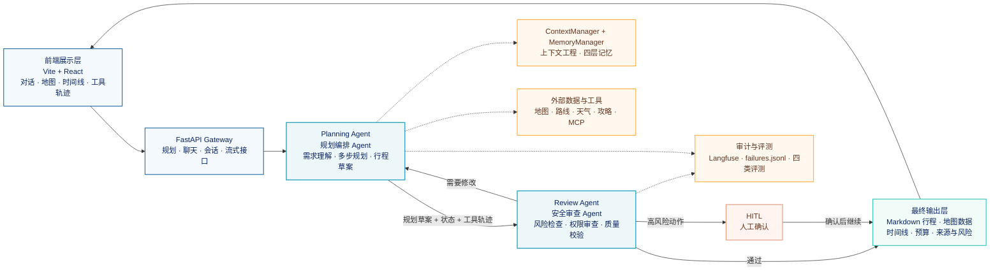

# 多 Agent 旅行规划服务

WanderMind 是一个面向出行旅游场景的智能体旅行规划服务。用户输入目的地、出行天数、预算、同行人和偏好后，系统会完成需求理解、隐性约束补全、景点搜索、路线规划、天气查询、预算估算和行程生成，最终输出包含 POI、交通路线、天气提示、预算拆分和风险说明的完整旅行方案。

系统的核心不是让大模型一次性生成一段旅行文字，而是把规划过程拆成可控的状态节点，再由两个职责不同的 Agent 协同完成：`Planning Agent` 负责规划，`Review Agent` 负责审查。每个节点只触发当前阶段需要的 Skill，外部数据、记忆信息和安全策略都通过受控状态传递。

## 一、功能点

### 1.1 自然语言旅行规划

用户可以直接描述“带孩子去广州玩五天，预算一万元，希望节奏轻松，想去有文化特色的地方”，不需要按照固定表单填写。系统会提取目的地、天数、预算、同行人、兴趣和节奏等信息，并转换为规划流程可以使用的结构化状态。

当关键信息不完整时，系统会主动追问，而不是直接生成一份假设过多的行程。对于“一家三口去广州”这类输入，还会结合同行人信息推导儿童友好、低步行强度、休息频率、亲子餐饮和室内备选等潜在约束，再通过追问确认。

### 1.2 多源景点发现与 POI 校验

系统结合地图 POI 与第三方旅游攻略。地图数据适合提供标准地点、坐标和路线，攻略内容更适合发现本地人熟悉的小众地点、网红路线和新兴体验。

攻略数据只负责发现候选，不会直接被当作最终事实。系统会对候选地点进行名称清洗、城市关联、类别识别、地理编码和 POI 校验，确认地点真实存在且能够进入路线规划，然后再进行去重和类别平衡。

### 1.3 多约束路线规划

路线规划同时考虑目的地、出行天数、每日时间、交通方式、预算和兴趣偏好。RouteSkill 根据景点坐标和交通信息估算地点之间的距离与耗时，再拆分每日访问顺序，尽量减少来回折返。

预算上限、出行天数和必须访问的地点属于硬约束；“节奏轻松”“偏好历史文化”“希望多安排美食”属于软偏好。硬约束无法满足时，状态机不会继续生成一份表面完整但实际不可执行的行程，而是阻断当前路径，要求调整约束或重新搜索。

### 1.4 天气、预算与备选方案

WeatherSkill 根据出行日期查询天气，并把高温、降雨和极端天气转换为对行程有影响的提示。对于户外景点，系统可以调整顺序或提供室内备选。

BudgetSkill 将交通、门票、餐饮、住宿和其他支出拆分成预算区间，并检查总预算是否超出用户约束。预算结果会反向影响景点选择、交通方式和每日安排。

### 1.5 流式过程与可视化结果

前端通过 SSE 或 WebSocket 接收状态节点和 Skill 的执行事件，实时展示当前正在进行的偏好提取、景点搜索、路线规划或安全审查。

页面将一次规划拆成多个可观察区域：对话区域展示用户与 Agent 的交互，地图区域展示 POI 和路线，时间线展示每日行程，工具面板展示外部调用，轨迹区域展示状态变化，安全面板展示风险和确认事项。

### 1.6 跨会话记忆与持续调整

系统保存会话历史、当前任务状态和长期偏好。用户可以继续追问“第二天不要安排太满”“预算控制在五千以内”“换成亲子景点”，Planning Agent 会基于当前规划状态进行调整，而不是每次从零开始。

记忆系统还支持跨会话延续，例如记录用户不喜欢早起、偏好人文景点或不喜欢辣食，下一次规划时检索相关信息，减少重复询问，同时避免把无关历史全部塞入上下文。

## 二、系统架构

### 2.1 总体架构图

这张图只表达系统边界和两个 Agent 的主协作关系，避免把所有节点、Skill 和基础设施堆在同一张图里。

图中的关键关系是：Planning Agent 只负责产出规划草案，不直接把结果返回用户；它把草案、TravelState、工具调用轨迹、数据来源和风险信息一起交给 Review Agent。Review Agent 审查通过后，才进入最终输出层；如果发现需要调整，则把修改意见退回 Planning Agent；如果触发高风险动作，则进入 HITL 人工确认。

### 2.2 两个 Agent 的职责边界

**Planning Agent（规划编排 Agent）**负责推动旅行规划向前执行。它理解用户需求，调用规划相关 Skill，维护规划状态，并按照 LangGraph 状态机完成从偏好收集到行程合成的过程。它关注的是“如何得到一份满足约束的旅行方案”。

**Review Agent（安全审查 Agent）**不重复规划景点和路线，而是接收 Planning Agent 的规划草案和执行证据，独立检查输入风险、工具权限、敏感信息、数据来源、输出质量和高风险动作。它关注的是“这份方案和这次执行是否允许继续”。

两个 Agent 使用不同的节点和 Skill 集合。Planning Agent 只拥有规划所需的业务能力，Review Agent 只拥有安全、审计、脱敏、质量检查和人工确认能力，从架构上限制单个 Agent 的工具范围和权限范围。

### 2.3 Planning Agent 的节点与 Skill

Planning Agent 采用 8 个规划节点推进主流程，最后把规划草案交给 Review Agent。整体业务生命周期仍然可以概括为“偏好 → 约束 → 搜索 → 路线 → 天气 → 预算 → 合成 → 安全 → 输出”九个阶段，其中安全阶段由 Review Agent 承担。

| 规划节点 | 触发的主要 Skill | 节点职责 |
|---|---|---|
| 偏好收集 | IntentSkill、PreferenceSkill | 识别用户意图，提取显性偏好并推导需要确认的隐性约束 |
| 约束标准化 | ConstraintSkill | 将预算、天数、节奏、同行人和必选项转换为硬约束与软偏好 |
| 目的地搜索 | MapSearchSkill、GuideSearchSkill | 合并地图 POI 与旅游攻略候选，清洗、校验、去重和分类平衡 |
| 路线规划 | RouteSkill | 根据坐标、交通方式和时间安排地点顺序，减少折返 |
| 天气分析 | WeatherSkill | 查询天气，将天气风险转成行程调整建议 |
| 预算估算 | BudgetSkill | 拆分交通、门票、餐饮和住宿成本，检查预算合规性 |
| 行程合成 | SynthesisSkill | 将结构化结果组织成每日行程、说明和备选方案 |
| 输出准备 | FormatSkill | 整理规划草案、引用来源、工具轨迹和待审查信息 |

节点负责“当前阶段应该做什么”，Skill 负责“这一阶段具体怎么完成”。例如搜索节点不会直接把整篇攻略交给模型，而是通过 GuideSearchSkill 抽取候选，再通过 MapSearchSkill 验证；路线节点也不会重新理解用户需求，只消费已经标准化的地点和约束。

### 2.4 Review Agent 的节点与 Skill

Review Agent 接收规划草案后，按独立审查链路执行：

Review Agent 的主要 Skill 包括 InjectionSkill、PermissionSkill、SecretSanitizeSkill、RiskReviewSkill、AuditSkill 和 HITLSkill。它既检查最终行程，也检查 Planning Agent 的工具调用轨迹和中间状态，避免只对最终文本做表面过滤。

### 2.5 共享状态与基础设施

两个 Agent 不共享全部执行权限，但共享经过定义的 TravelState。状态中包含用户偏好、约束、POI、路线、天气、预算、规划草案、工具调用记录、引用来源、风险提示和审查结果。Planning Agent 写入规划字段，Review Agent 写入审查字段，Orchestrator 负责控制状态的传递和恢复。

ContextManager 负责把原始工具结果压缩成当前节点需要的上下文；MemoryManager 负责会话、语义、情景和程序四层记忆；外部工具层负责连接地图、路线、天气和攻略服务；Langfuse、审计日志和评测模块负责记录执行过程与质量结果。

## 三、项目亮点

### 3.1 规划与审查真正分离

很多 Agent 系统让同一个模型既规划又自我检查，实际执行时容易出现“自己生成、自己认可”的问题。WanderMind 将 Planning Agent 和 Review Agent 拆开：前者负责获得方案，后者负责判断方案能否继续。Planning Agent 的输出必须经过 Review Agent 审查后才能进入最终输出层。

这种分离不仅是角色名称的变化，也体现在节点、Skill 和权限上。规划 Agent 不直接持有安全审查能力，审查 Agent 也不负责调用路线和攻略工具，二者通过状态和审查结论协作。

### 3.2 节点与 Skill 解耦

状态机节点控制顺序和条件分支，Skill 提供可复用能力。新增一个酒店搜索 Skill 时，可以挂载到约束或预算相关节点，而不需要重写两个 Agent；修改安全规则时，也只调整 Review Agent 的审查 Skill，不会破坏路线规划逻辑。

这种设计还降低了工具误用风险。每个节点只暴露必要能力，模型不需要在十几个工具中自行判断当前应该调用哪个，从而减少跳过地理编码、错误传参或重复调用等问题。

### 3.3 四层上下文工程，控制 Token 爆炸

POI、路线、天气和攻略工具返回的数据量差异很大，单次结果可能达到数千 Token。如果把全部原始内容拼到每个 Prompt 中，模型很容易在长文本中遗漏预算和时间约束。

项目通过四层 ContextManager 解决这个问题：原始数据层保留完整证据，压缩摘要层提取规划字段，约束上下文层集中管理硬约束和软偏好，当前 Prompt 层只注入本节点真正需要的信息。长 token 内容写入文件系统，模型需要时按引用读取，从而兼顾完整性、可追溯性和上下文成本。

### 3.4 四层记忆支持跨会话延续

会话记忆保存完整对话，语义记忆保存稳定偏好，情景记忆保存某次旅行中的选择和反馈，程序记忆保存规划规则与工具经验。四层记忆不混在同一个检索列表中，而是根据当前节点选择性使用。

这样可以同时解决两个问题：一方面，用户可以回到之前的会话继续修改；另一方面，新的规划不会被无关历史淹没，只会检索与当前目的地、兴趣和约束相关的内容。

### 3.5 评测结果能够反向改进系统

系统使用 RACE、DoVer、AgentWorld 和 FACT 分别评价端到端质量、推理过程、工具链正确性和事实引用准确性。失败样本写入 `failures.jsonl`，后台 Agent 定期归纳失败模式并更新 `AGENTS.md`，让失败记录可以转化为新的执行规则和约束。

### 3.6 安全防护覆盖执行前后

安全层覆盖输入、工具、日志和动作四个位置。输入侧进行高风险关键词和双层 Injection 检测，工具侧进行权限分级和参数检查，日志侧进行 Secret 实时脱敏，动作侧对预订、支付等高风险行为强制 HITL 确认。

## 四、遇到的挑战与解决方案

### 4.1 直接按城市地理位置搜索，发现不了足够好的景点

最初只通过城市地理位置和周边 POI 搜索景点，能够找到标准化程度较高的博物馆、公园和热门景区，但对本地人熟悉的小众地点、网红路线和新兴体验覆盖不足。城市范围较大时，单个中心点还会造成空间覆盖偏差。

解决方式是引入 JustOneAPI 等第三方内容接口搜索城市旅游攻略，尤其利用小红书内容作为地点发现信号。但攻略内容不能直接作为事实使用，因为其中可能包含标签、营销文案、路线描述、情绪词和不完整地点名。

因此系统采用“攻略发现候选，地图服务验证 POI”的两阶段策略：先抽取候选地点，再进行名称规范化、城市关联、地理编码和 POI 校验，最后才进入路线规划。这样既获得攻略内容中的本地化信息，又避免把“广州旅游攻略”“citywalk 路线”之类的内容词当成真实景点。

### 4.2 多工具返回结果过长，模型出现上下文爆炸

POI、路线、天气和攻略接口返回的数据结构不同，原始结果中有大量当前节点不需要的字段。若把这些内容全部放入 Prompt，模型会在长文本中忽略关键约束，Token 成本和响应延迟也会持续上升。

项目将原始结果写入文件系统或数据存储，再通过 ContextManager 生成压缩摘要。规划节点主要接收名称、坐标、距离、时间、价格、来源和风险等必要字段；需要完整证据时再按引用读取。上下文因此从“所有数据一起传递”变成“当前节点按需读取”。

### 4.3 隐性约束容易被简单实体抽取遗漏

“一家三口去广州”不只是目的地信息，还隐含儿童友好、步行强度、休息频率、亲子餐饮和室内备选等需求。如果只提取城市和天数，最终行程虽然格式完整，却可能不适合真实同行人。

项目使用规则与 LLM 推导结合的方式：规则识别同行人、预算和天数等稳定字段，LLM 推导可能影响规划的隐性偏好，系统再把推导结果转成可确认的追问。这样减少了对话轮次，也避免把模型猜测直接当成用户明确要求。

### 4.4 单 Agent 工具过多，节点顺序容易失控

一个 Agent 同时挂载地图、路线、天气、预算、记忆、安全和评测工具后，容易出现工具选择错误、参数不完整或节点跳跃。例如没有完成地理编码就直接搜索 POI，或者路线数据不足仍然继续合成行程。

项目采用 Planning Agent + Review Agent 的双 Agent 结构，并在 Agent 内部继续拆分多个 Skill。Planning Agent 只推进规划节点，Review Agent 只执行审查节点；LangGraph 负责状态转移，节点只挂载阶段所需 Skill，条件分支和迭代计数器负责防止错误循环。

### 4.5 规划结果需要经过独立审查

Planning Agent 的目标是尽可能找到满足用户要求的方案，但它不应该同时决定“自己的结果是否安全”。因此 Planning Agent 输出的不是最终答案，而是带有 TravelState、工具轨迹、来源和风险信息的规划草案。

Review Agent 对草案进行输入风险、Prompt Injection、工具权限、Secret、引用和高风险动作检查。通过后才进入最终输出；发现问题时返回修改意见，必要时暂停并触发 HITL。这个闭环把“生成”和“批准”拆成了两个不同职责。

### 4.6 记忆越多，检索噪声越大

如果把历史消息、长期偏好和当前规划混在一起，用户对话越长，真正相关的信息比例越低。项目将记忆分成会话、语义、情景和程序四层，并由 MemoryManager 按当前节点选择性检索。

当前任务优先使用会话状态和工作记忆，跨会话规划才检索语义和情景记忆，程序记忆则用于补充规划规则和工具经验。这样既能保留连续体验，又不会把无关历史带入当前 Prompt。

### 4.7 旅行规划质量不能只用一个分数衡量

最终文本通顺并不代表路线合理，工具调用正确也不代表预算合规。因此系统使用四类评测分别检查端到端结果、推理步骤、工具链和事实引用，并将失败样本写入 `failures.jsonl`。

评测的价值不只是生成报告，还要能够改变后续行为。后台 Agent 会根据失败样本归纳高频问题，更新 `AGENTS.md` 中的规则、约束和工具使用要求，形成“执行 → 评测 → 失败归因 → 规则更新”的闭环。

### 4.8 流式响应与外部服务波动

景点搜索、攻略接口、路线和天气查询都可能耗时，外部服务还可能超时、返回空数据或字段变化。系统通过 SSE 和 WebSocket 推送中间状态，前端可以知道当前流程仍在工作；工具层增加重试、缓存和降级策略，单个服务失败时保留其他可用路径，并把不确定性记录到风险提示中。

## 五、一次完整规划的执行过程

1. 用户通过前端输入自然语言旅行需求。
2. FastAPI Gateway 创建或恢复会话，并将请求交给 Planning Agent。
3. Planning Agent 通过 IntentSkill 和 PreferenceSkill 识别意图、提取偏好并补全隐性约束。
4. ConstraintSkill 将信息划分为硬约束和软偏好，缺少关键字段时触发澄清。
5. MapSearchSkill 与 GuideSearchSkill 搜索并校验景点候选。
6. RouteSkill、WeatherSkill 和 BudgetSkill 分别补充路线、天气和预算信息。
7. SynthesisSkill 生成带来源、风险和中间证据的规划草案。
8. Planning Agent 将草案、TravelState、工具轨迹和引用来源交给 Review Agent。
9. Review Agent 执行输入、注入、权限、脱敏、结果和高风险动作审查。
10. 审查通过后进入最终输出层；需要修改时退回 Planning Agent；高风险操作进入 HITL。
11. 前端将最终结果拆分到对话、地图、时间线、预算、工具和安全面板。
12. 会话、记忆、轨迹、审计和评测结果按配置持久化，失败样本进入后续改进流程。

## 六、设计结果

通过上述拆分，系统形成了清晰的职责边界：Planning Agent 负责把用户需求收敛成规划草案，Review Agent 负责判断草案和执行过程是否允许继续，Skill 负责具体业务或安全能力，LangGraph 负责节点顺序和状态转移，ContextManager 负责控制上下文规模，MemoryManager 负责跨会话延续，评测与审计系统负责解释问题并推动改进。

最终输出不再是一个无法追溯的模型回答，而是一份经过多节点规划、外部数据校验、独立安全审查和多维质量评估的旅行方案。
